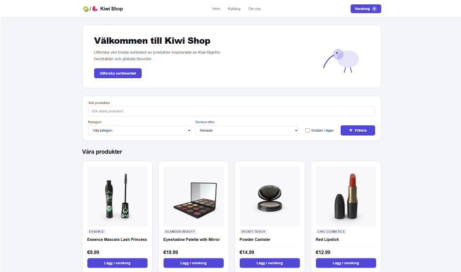

# 🥝🐦 Kiwi Shop | Frontend education project

The sixth project I worked on during the Frontend education at Lexicon where the primary goal was to exercise in using AI for front-end development.

**Kiwi Shop** is a local web shop where a visitor can browse products, add them to a cart, complete a simulated checkout, and receive an order confirmation.

The project is built in Next.js using TypeScript and uses a local copy of the product data from [DummyJSON](https://dummyjson.com/docs/products) which is fetched from a local API powered by [JSON Server](https://github.com/typicode/json-server/tree/v0.17.4).


> [!NOTE]
> The website is entirely in Swedish. Your browser can propably translate the website though. Try right clicking anywhere on the website and then "Translate to English" (or whatever language is your default).

---



---


## 🚀 Features

- 🔎Browse among different categories of products.
- 📱A (mostly) responsive design.
<!--
- [ ] 🛒Add products to the shopping cart.
- [ ] 💳Complete a simulated checkout.
- [ ] 📦Receive an order confirmation.
-->


## ⚙️ Technologies

- Next.js version 16.3.4
- React version 19.2.8
- TypeScript
- Both regular CSS and Modular CSS
- [JSON Server](https://github.com/typicode/json-server/tree/v0.17.4)
- ChatGPT app (Codex)
- Google Antigravity (both Gemini, Claude and GPT models)


## 📋 Requirements before installation

- **Node.js** - version 24.18 or later is recommended
- **npm** - version 12 or later is recommended
- **Visual Studio Code** - to open and run the project
- **Git** - to clone repository from Github (optional)


## 📦 Installation steps

1. Clone the repository with Git or download the ZIP-file from GitHub.
``` bash
git clone https://github.com/wilkin-2005/kiwi-shop.git
```

2. Open the root folder `kiwi-shop` with Visual Studio Code.

3. Install dependencies by running `npm install` in VS Code's built-in terminal.

4. Create a build of the application by running `npm run build` in the VS Code terminal.

5. Start the local API by running `npm run server` in terminal.

6. Start the production server by running `npm run start`.

7. Then open [localhost:3000](http://localhost:3000) in your browser where you should see the website.


## ▶️ Usage

1. Open the application like explained above: [Installation steps](#-installation-steps).

<!-- 2. Needs updating when new functionallity have been added. -->


## 📂 Project Structure

``` text

kiwi-shop/
|
├── src/
|   |
|   ├── app/
|   |   ├── layout.tsx
|   |   ├── globals.css
|   |   ├── page.tsx + page.module.css
|   │   └── error.tsx + error.css
|   |
|   ├── components/
|   |   └── example-component/
|   │       ├── example-component.tsx
|   │       └── example-component.css
|   |
|   ├── lib/
|   |   └── product-api.ts      # Functions related to the local API
|   |
|   ├── server/
|   |   └── products.json       # Product data and empy array for order data
|   |
|   └── types/
|       └── products.ts         # Types for the products
|
|
├── public/         # Static files like images and SVGs
|
├── docs/           # Documentation and instructions mostly intended for AI Agents
|
├── CONTEXT.md      # Written by an AI Agent during project planning using the "/grill-with-docs" Skill
├── AGENTS.md       # Instruktions for AI Agents with task-specific guidance linking to files in /docs
└── CLAUDE.md       # Just points to AGENTS.md

```


## 🗺️ Roadmap

- [x] Browse among different categories of products.
- [ ] Product details page.
- [ ] Shopping cart page.
- [ ] Add products to the shopping cart.
- [ ] Complete a simulated checkout.
- [ ] Receive an order confirmation.
- [ ] Search and filter functionality.
- [ ] Functioning pagination.


## 🪳 Known Issues

- The search and filter fields doesn't work.
- The pagination doesn't work.
- The project currently only consists of a homepage, so none of the links lead anywhere.


## 👥 Author

### Wilmer Kindstedt
- GitHub: [@wilkin-2005](https://github.com/wilkin-2005)
- LinkedIn: [Wilmer Kindstedt](https://www.linkedin.com/in/wilmer-kindstedt-7b6a99407/?skipRedirect=true)


## 🙏 Credits / Acknowledgements
- Product data from [DummyJSON](https://dummyjson.com/docs/products)
- Icons from [Font Awesome](https://fontawesome.com/) (icon on filter button and an unused Kiwi bird-icon)
- Help for using coding agents inkluding *skills*: [AI Hero](https://www.aihero.dev/) by Matt Pocock
- [Next.js Naming Conventions](https://www.piyushgambhir.com/blogs/next-js-naming-conventions)
- Design inspiration from previus group project.
    - [Webshop admin](https://github.com/Lexicon-Utbildning-Front-end-2026/Webshop-admin) project instruktions
    - My groups GitHub repository: [projekt-agila-metoder-grupp-6](https://github.com/wilkin-2005/projekt-agila-metoder-grupp-6)